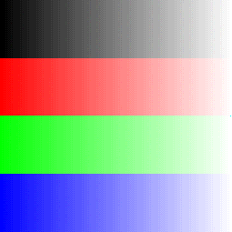
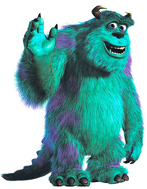

<!doctype html>

<html lang="en">
<head>
	<meta charset="utf-8">

	<title>Assignment1</title>
	<meta name="Assignment 1" content="Image Processing">
	<meta name="James Wang" content="SitePoint">

	<link rel="stylesheet" href="css/styles.css?v=1.0">

</head>

<body>
	<header>

James Wang

jqw3ha

Compiler: g++/gnu | Environment: Linux (Ubuntu 12.04 Precise) | Platform: 64bit

Late days used: 1

	</header>
	

*   AddRandomNoise 0.5

    				
*   Brighten 2

    				
*   Luminance

    				
*   Contrast 2

    				
*   Saturate 2

    				
*   Crop (100,100) (500,500)

    				
*   Quantize 4

    				
*   RandomDither 4

    				
*   Ordered Dither 2x2 4

    				
*   FloydSteinbergDither: Not Implemented

*   Blur3x3 //Blurs image, but makes it darker

    				
*   Edges3x3

    				
*   NearestSample: Implemented, see below

*   BilinearSample: Implemented, see below

*   GaussianSample: Not Implemented

*   ScaleNearest 1.3

    				
*   ScaleBilinear 1.3

    				
*   ScaleGaussian: Not Implemented

*   SetComposite, SetAlpha //Created a composite image of myself and a famous person!

    				
*   FunFilter: Semi-Implemented. Swirl, doesn't quite work, but it swirls!

*   Beier-Neely Morphing: Not Implemented

*   Art Submission: Steps of each frame: saturate [-2,2] with 0.5 intervals

      				

	

</body>
</html>
